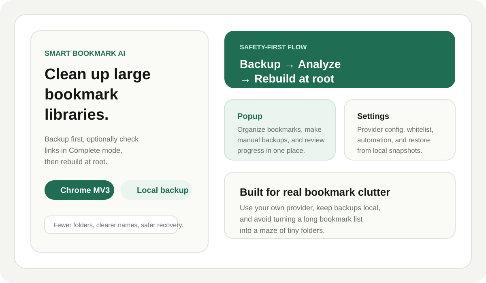
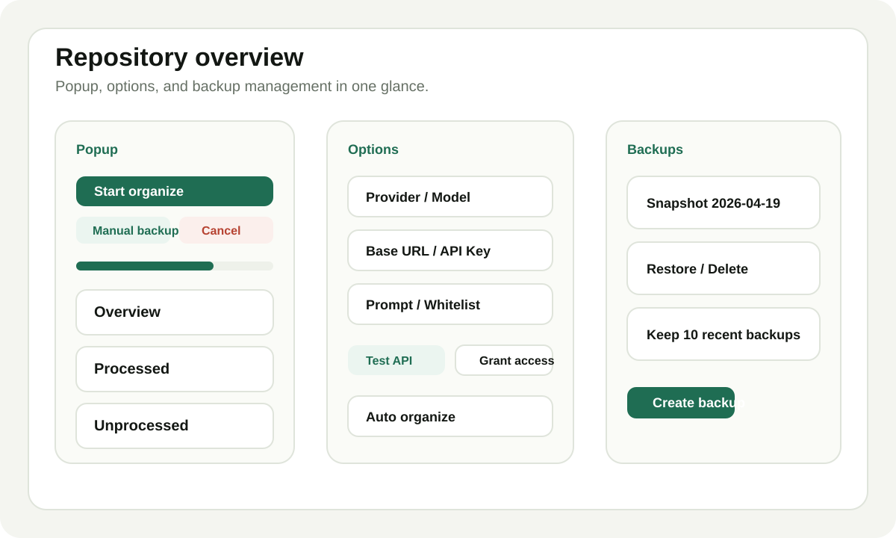
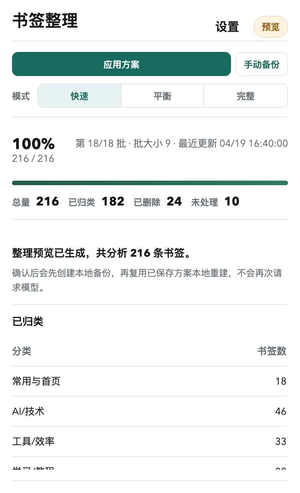
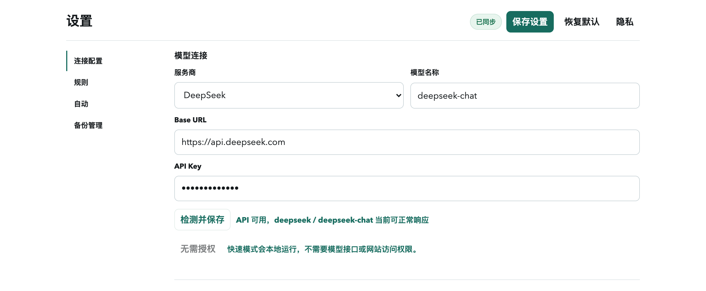
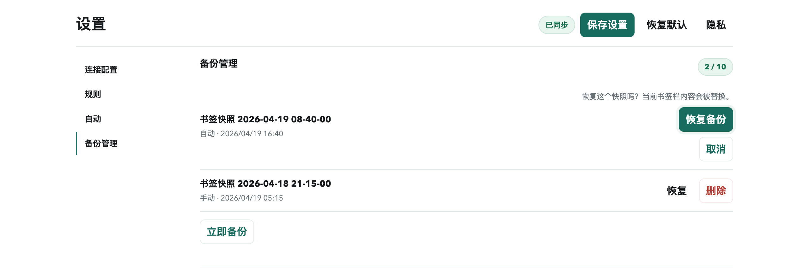
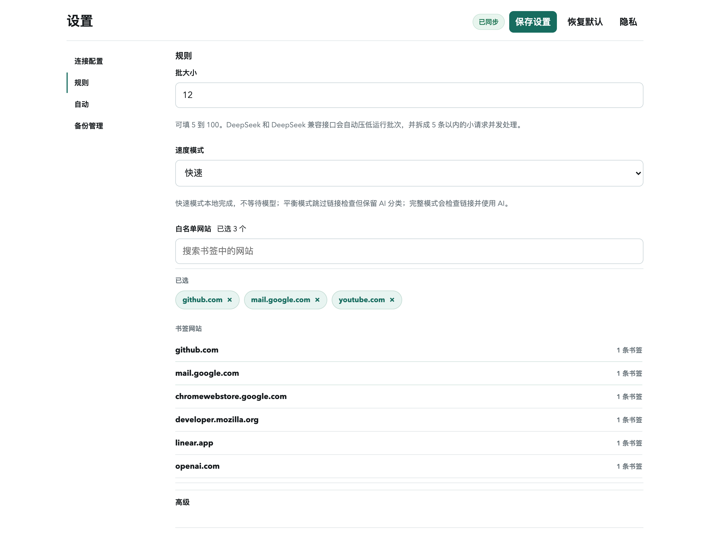
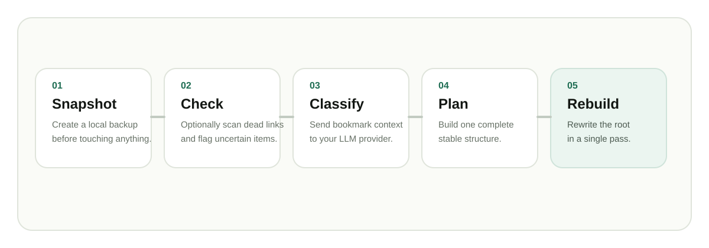

# Marko

<p align="center">
  
</p>

<p align="center">
  <strong>A calmer Chrome bookmark organizer, powered by the model you choose.</strong>
</p>

<p align="center">
  <a href="README.md">English</a> ·
  <a href="README.zh-CN.md">简体中文</a> ·
  <a href="https://github.com/Ariandel35/marko/issues">Issues</a> ·
  <a href="PRIVACY.md">Privacy</a> ·
  <a href="SECURITY.md">Security</a>
</p>

<p align="center">
  
  
  
</p>

<p align="center">
  
</p>

Marko helps turn a crowded Chrome bookmark bar into a smaller, clearer, easier-to-browse structure. It previews an AI-assisted cleanup plan first, creates a local backup before real changes, and only rebuilds your bookmarks after you choose to apply the plan.

## Why Marko

| A messy bookmark library usually has... | Marko responds with... |
| --- | --- |
| Duplicate links scattered across folders | Conservative duplicate cleanup before classification |
| Old links that no longer open | Dead-link checks that remove only clearly failed URLs |
| Folders created one batch at a time | Stable root categories in Fast mode; Balanced keeps AI without link scans; Complete can use global planning on faster providers |
| Risky one-click cleanup tools | Preview first, backup second, rebuild last |
| Too many settings for a simple task | A focused popup and a shorter setup path |

## Product Tour

<p align="center">
  
</p>

<table>
  <tr>
    <td width="34%">
      
    </td>
    <td width="33%">
      
    </td>
    <td width="33%">
      
    </td>
  </tr>
  <tr>
    <td><strong>Popup</strong><br />Preview, apply, back up, cancel, and watch progress from one compact panel.</td>
    <td><strong>Connection</strong><br />Choose a provider, test the API, save the working model, and keep advanced fields out of the way.</td>
    <td><strong>Backups</strong><br />Create, inspect, restore, and delete local bookmark snapshots; restore first saves the current state as a new rollback point.</td>
  </tr>
</table>

<table>
  <tr>
    <td width="50%">
      
    </td>
    <td width="50%">
      
    </td>
  </tr>
  <tr>
    <td><strong>Apply</strong><br />Confirm the saved preview inline, then back up and rebuild locally without a second model run.</td>
    <td><strong>Rules</strong><br />Tune speed mode with the same Fast/Balanced/Complete segmented control as the popup, plus batch size, whitelist websites, and advanced rules.</td>
  </tr>
</table>

## Safe Organizing Flow

<p align="center">
  
</p>

1. Generate a preview plan without changing the current bookmark tree.
2. Create a local snapshot backup before a real organize run.
3. Use the selected mode: Fast local rules, Balanced AI classification without link scans, or Complete link checks plus AI classification.
4. Detect exact duplicates and preserve uncertain items for review.
5. Faster Complete providers can plan a global taxonomy first; slow providers skip that extra request and can fall back locally on timeout.
6. Rebuild the bookmark bar root in one final pass.

## What v3.0 Focuses On

| Area | v3.0 behavior |
| --- | --- |
| Main action | `Preview` is the first step. `Apply Plan` appears only when a plan is ready. |
| Popup mode switch | Fast/Balanced/Complete can be changed directly in the popup, and any saved preview is invalidated when the mode changes. |
| Setup | Missing provider, Base URL, or model routes the user to settings. Fast preview does not request model access, so the settings page keeps AI connection fields collapsed until Balanced or Complete needs them. |
| API settings | `Test & Save` validates the connection, stores the working configuration, reports if automation access still needs approval, and keeps API keys hidden by default with a show/hide check when needed. |
| Slow models | DeepSeek and DeepSeek-compatible runs skip the separate taxonomy-planning request, cap each runtime batch at 9 bookmarks, split model requests to 3 bookmarks each, and run up to three mini requests at a time. Batches wake immediately while a Chrome alarm remains as fallback. They stop waiting after a 6-second first-response stall or a 14-second full-response stall, then finish with local rules, cache, built-in rules, and manual review. |
| Progress feedback | The popup shows elapsed time and, after real progress is available, an estimated remaining time. If the background status has not changed for 45 seconds, the detail panel explains that the model may still be slow and offers a one-click stop-and-use-Fast action plus direct cancel. A lightweight once-per-second clock keeps time text fresh without reloading the full popup state every second. |
| Apply speed | Applying a ready preview reuses the saved plan and rebuilds locally without a second model run. |
| Speed mode | Fast mode skips dead-link checks, the extra taxonomy-planning request, and model waiting; unmatched bookmarks go to manual review. Balanced skips dead-link checks and extra planning but keeps AI classification. Complete keeps link checks and AI classification, but deterministic built-in domain rules run before AI so common sites do not spend model time. |
| Complete link checks | Complete mode checks up to 8 links at a time and leaves links that take longer than 6 seconds for review, so slow sites do not hold up the whole preview. |
| Local reruns | Fast mode can preview without asking for an API key or model endpoint access, because custom rules, cached classifications, built-in domain rules, and manual-review fallback finish locally. |
| Automation | Fast automatic organize can run locally without an API key; the Silent organize switch enables the interval field only when needed and shows the permission impact inline before saving. |
| DeepSeek | New/reset configurations start at 9; older large-batch settings are capped when loaded or saved, DeepSeek-compatible Base URLs or model names use the same profile, and active older jobs are normalized before the next batch. Settings warn inline before a slow-model batch cap is applied. |
| Advanced rules | Protected folders, domain rules, and prompt fields stay available but quieter. |
| Language | English and Simplified Chinese are both supported in the extension UI. |

## Model Providers

Marko works with OpenAI, DeepSeek, MiniMax, Anthropic, Gemini, OpenRouter, Groq, xAI, Moonshot AI, Ollama, and generic OpenAI-compatible endpoints.

You can configure the provider, Base URL, API key, model name, prompt, batch size, whitelist, protected root folders, and domain-to-folder rules.

## Install Locally

1. Open `chrome://extensions`.
2. Enable `Developer mode`.
3. Click `Load unpacked`.
4. Select this repository root.

## Development

Run the static checks and extension tests:

```bash
npm test
```

Audit popup and settings layout across narrow and wide viewports:

```bash
npm run audit:ui
```

Run a real unpacked-extension smoke test with Chrome for Testing or Chromium:

```bash
npm run e2e:extension
```

If neither browser is installed in a standard location, install Playwright Chromium first:

```bash
npm run install:e2e-browser
```

The script uses a temporary browser profile, seeds real bookmarks, then verifies the real popup Preview -> Apply Plan confirmation click flow, stale progress stop-and-use-Fast recovery, the real popup unprocessed-item Delete button, the real settings Backup UI create/restore/delete flow, a 100-bookmark Fast-mode scale run, manual backup, Fast preview, duplicate cleanup, backup records, real options UI save, DeepSeek batch-size capping, the popup, and the options page.
Automated Chrome runs are headless by default, so they do not open visible browser windows. The E2E runner also checks the Playwright browser cache and `PLAYWRIGHT_BROWSERS_PATH` before failing. Set `MARKO_SHOW_BROWSER=1` only when you need to watch the run, and set `MARKO_EXTENSION_SCREENSHOT_DIR=/tmp/marko-e2e` to keep popup and options screenshots.

Regenerate README and Chrome Web Store screenshots after UI or store-copy changes:

```bash
npm run render:store-assets
```

The renderer also runs headless by default, uses the committed `playwright-core` dev dependency, and controls your installed Chrome or Chrome for Testing without downloading a browser. Run `npm install` first on a fresh checkout, and set `MARKO_RENDER_BROWSER` when Chrome for Testing is not installed in a standard location.

Run the full release gate before uploading a package:

```bash
npm run verify:release
```

Run the release gate plus the real extension smoke test:

```bash
npm run verify:release:full
```

Build the Chrome Web Store upload package:

```bash
npm run package:webstore
```

Core files:

| File | Purpose |
| --- | --- |
| [manifest.json](manifest.json) | Chrome MV3 extension manifest |
| [background.js](background.js) | Organizing jobs, backups, scanning, and rebuild logic |
| [providers.js](providers.js) | Provider defaults, request builders, and response parsing |
| [popup.js](popup.js) | Preview and apply flow |
| [options.js](options.js) | Settings, API test, backups, and rules |
| [i18n.js](i18n.js) | English and Simplified Chinese copy |
| [tests](tests) | JSON, rules, cache, asset, and i18n checks |
| [docs](docs) | README visuals and screenshots |
| [webstore](webstore) | Chrome Web Store listing material |

## Privacy Boundaries

- Bookmark titles, URLs, current paths, prompts, API settings, caches, and backups stay in local browser storage unless Balanced/Complete preview or enabled auto organize needs external access.
- Bookmark metadata is sent only to the model provider you configured when Balanced/Complete preview or enabled auto organize still needs model classification after local rules and cache reuse.
- Applying a saved preview plan rebuilds locally and does not call the model again.
- API keys are stored locally and are never sent to this project or its developer.
- Balanced mode can use model classification without directly checking bookmarked websites. Complete mode connects directly to bookmarked websites for link checks and uses model classification. Faster providers may add a separate taxonomy-planning request; slow providers skip that extra request. Fast mode skips those external requests.
- Snapshot backups are local and can be restored or deleted from the settings page; restoring creates a fresh local snapshot first.

Read the full policy in [PRIVACY.md](PRIVACY.md).

## Links

- Homepage: [github.com/Ariandel35/marko](https://github.com/Ariandel35/marko)
- Support: [github.com/Ariandel35/marko/issues](https://github.com/Ariandel35/marko/issues)
- Privacy policy: [github.com/Ariandel35/marko/blob/main/PRIVACY.md](https://github.com/Ariandel35/marko/blob/main/PRIVACY.md)
- Security reporting: [github.com/Ariandel35/marko/security/advisories/new](https://github.com/Ariandel35/marko/security/advisories/new)
