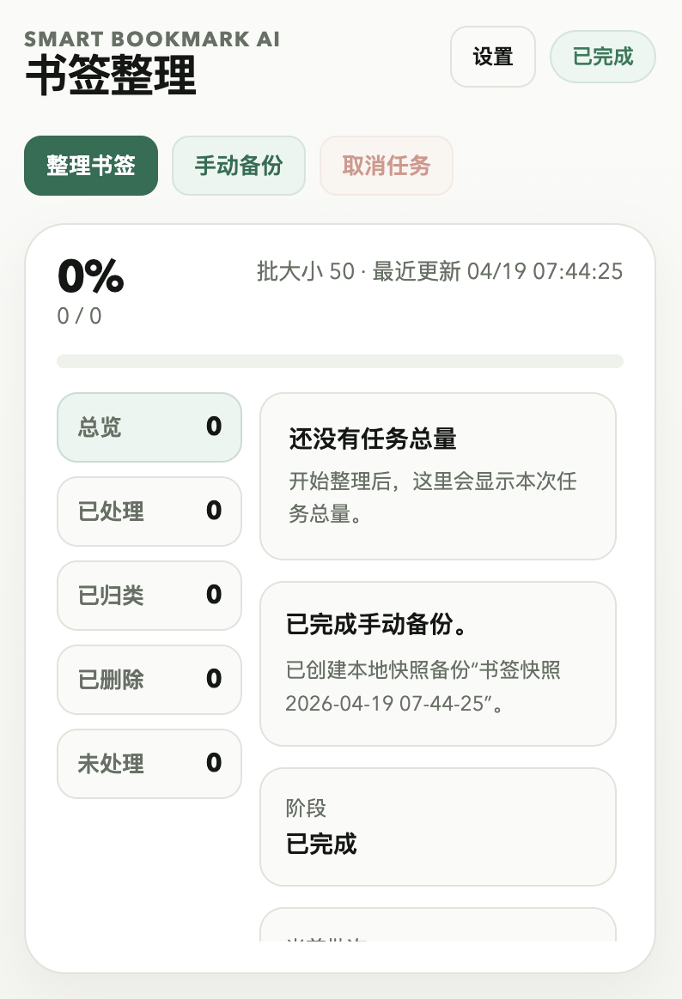
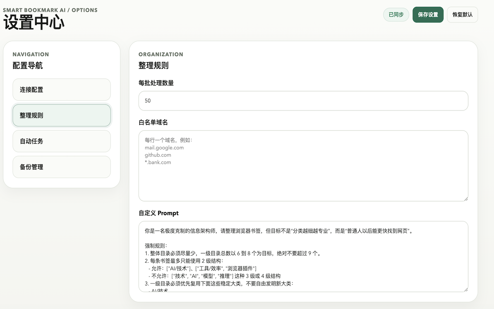

# Smart Bookmark AI

[English](README.md) | [简体中文](README.zh-CN.md)


Smart Bookmark AI 是一个基于 Chrome Manifest V3 的书签整理扩展，主要用于帮助用户清理数量庞大、结构混乱的书签库。

它会先创建本地快照备份，再检测明显失效的链接、清理明显重复的书签，并结合你选择的大语言模型，对剩余书签进行语义分类，最后把整理后的结构直接重建到书签栏根目录。

<p align="center">
  
</p>

## 它解决什么问题

- 书签太多，根本找不到想看的网页
- 重复链接过多，文件夹越堆越乱
- 失效书签长期残留，影响整理质量
- 不同模型服务商需要灵活配置

## 界面预览

### 产品概览

<p align="center">
  
</p>

这张概览图用于快速说明弹窗、设置中心和备份管理之间的关系。

### 弹窗首页

<p align="center">
  
</p>

弹窗把主要操作集中在顶部，整理书签、手动备份、取消任务和进度查看都在一个页面里完成。

### 设置中心

<p align="center">
  
</p>

设置中心使用左侧导航分页，分别管理连接配置、整理规则、自动任务和备份管理。

## 核心特点

- 支持 OpenAI、DeepSeek、MiniMax 和 Ollama
- 支持自定义 Base URL、API Key、模型名和 Prompt
- 支持大规模书签分批处理
- 先扫描明显失效链接，再进行 AI 分类
- 保守去重，尽量避免误删
- 支持白名单域名，不整理指定网站
- 每次整理前自动创建本地快照备份
- 支持手动备份、恢复与删除
- 支持自动静默整理
- 支持查看未处理项与删除记录

## 工作流程

这个扩展强调“先分析、后重建”，不会在分析还没结束时一边跑一边改动你的原始书签结构。

<p align="center">
  
</p>

1. 创建本地快照备份
2. 扫描明显失效的书签链接
3. 将书签上下文发送到你自己配置的模型服务商
4. 生成完整整理方案
5. 一次性在根目录重建新的书签结构

## 隐私摘要

- 书签内容只会发送到你自己选择的模型服务商
- API Key 和备份数据只保存在本地浏览器
- 失效链接检测会直接访问书签对应的网站
- 扩展开发者不会接收你的书签数据

完整隐私说明见 [PRIVACY.md](PRIVACY.md)。

## 所需权限

- `bookmarks`：读取、移动、删除和重建书签
- `storage`：保存设置、任务状态和备份记录
- `alarms`：支持自动整理和批次调度
- 网站访问权限：运行时申请，用于模型 API 请求和失效链接检测

## 仓库结构

- [manifest.json](manifest.json)
- [background.js](background.js)
- [popup.html](popup.html)
- [popup.js](popup.js)
- [options.html](options.html)
- [options.js](options.js)
- [styles.css](styles.css)
- [privacy.html](privacy.html)
- [docs/assets](docs/assets)
- [docs/screenshots](docs/screenshots)
- [webstore](webstore)

## 本地开发

1. 打开 `chrome://extensions`
2. 启用“开发者模式”
3. 点击“加载已解压的扩展程序”
4. 选择当前仓库根目录

### 语法检查

```bash
node --check background.js
node --check options.js
node --check popup.js
```

## GitHub 与 Chrome Web Store

- 仓库主页：[github.com/Ariandel35/smart-bookmark-ai](https://github.com/Ariandel35/smart-bookmark-ai)
- 支持地址：[github.com/Ariandel35/smart-bookmark-ai/issues](https://github.com/Ariandel35/smart-bookmark-ai/issues)
- 隐私政策：[github.com/Ariandel35/smart-bookmark-ai/blob/main/PRIVACY.md](https://github.com/Ariandel35/smart-bookmark-ai/blob/main/PRIVACY.md)

Chrome 商店上架材料已经整理在 [webstore](webstore) 目录中。
